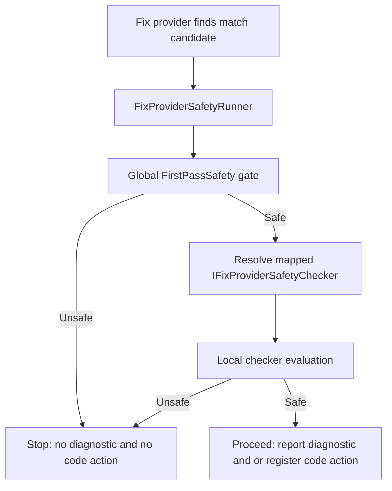

## Context

Sharpen.Analyzer needs to ensure that:

- diagnostics are not reported when the corresponding fix would be unsafe, and
- code actions are not offered when the fix cannot be safely applied.

The codebase currently has two concepts that overlap:

- a global first-pass safety gate (implemented by [`FirstPassSafetyRunner`](Sharpen.Analyzer/Sharpen.Analyzer/Sharpen.Analyzer/Safety/FirstPassSafetyRunner.cs:1))
- per-fix-provider safety checkers (documented in [`FixProviderSafety`](Sharpen.Analyzer/Sharpen.Analyzer/Sharpen.Analyzer/Safety/FixProviderSafety/README.md:1))

This change consolidates them into a single, explicit pipeline executed by `FixProviderSafetyRunner`.

## Goals / Non-Goals

### Goals

- Provide **one entry point** for safety evaluation: `FixProviderSafetyRunner`.
- Ensure the unified pipeline always runs:
  1. a **global FirstPassSafety** stage, then
  2. the **mapped per-fix-provider** checker stage.
- Preserve the existing mapping approach (one fix provider ↔ one checker) and its validation.
- Make migration mechanical: update all fix providers to call `FixProviderSafetyRunner`.
- Make behavior testable: ordering, short-circuiting, and outcome propagation.

### Non-Goals

- Changing the semantics of individual safety checkers.
- Reworking analyzer/fix-provider architecture beyond routing safety through the unified runner.
- Performance micro-optimizations beyond obvious short-circuiting.

## Proposed Architecture

### High-level pipeline

### Key decisions

#### 1) `FixProviderSafetyRunner` is the single orchestration point

**Decision:** All safety evaluation is executed by `FixProviderSafetyRunner`.

**Rationale:**

- Eliminates ambiguity about which safety mechanism ran.
- Centralizes ordering and short-circuiting.
- Makes it easy to enforce adoption (tests + code review + deprecation).

#### 2) Two-stage evaluation: global then local

**Decision:** The unified runner evaluates:

1. **Global FirstPassSafety** (cheap, conservative, cross-cutting)
2. **Local per-fix-provider checker** via [`IFixProviderSafetyChecker`](Sharpen.Analyzer/Sharpen.Analyzer/Sharpen.Analyzer/Safety/FixProviderSafety/IFixProviderSafetyChecker.cs:1)

**Rationale:**

- Global gate catches broad “never safe” conditions early.
- Local checker captures fix-specific preconditions.
- Ordering is deterministic and easy to test.

#### 3) Keep the mapping registry as the canonical source

**Decision:** Continue using the existing fix-provider-to-checker mapping and validation as the canonical registry.

**Rationale:**

- Maintains the one-to-one ownership model.
- Avoids reintroducing discovery magic.
- Keeps the system self-auditing.

#### 4) Deprecate `FirstPassSafetyRunner`

**Decision:** Mark [`FirstPassSafetyRunner`](Sharpen.Analyzer/Sharpen.Analyzer/Sharpen.Analyzer/Safety/FirstPassSafetyRunner.cs:1) as deprecated and migrate all call sites to `FixProviderSafetyRunner`.

**Rationale:**

- Prevents new code from using the old entry point.
- Enables eventual removal once migration is complete.

## API / Behavior Notes (spec-level)

- `FixProviderSafetyRunner` returns a structured result that can represent:
  - global gate unsafe (with reason)
  - local checker unsafe (with reason)
  - safe
- The runner must short-circuit:
  - if global gate is unsafe, local checker is not evaluated
  - if local checker is unsafe, fix computation is not executed
- The runner must be usable from both:
  - analyzer diagnostic emission path
  - code fix provider code action registration path

## Migration Plan

1. Introduce/confirm `FixProviderSafetyRunner` as the single entry point and add the global FirstPassSafety stage inside it.
2. Mark `FirstPassSafetyRunner` as deprecated (documentation + compiler warning if feasible).
3. Update all fix providers to call `FixProviderSafetyRunner`.
4. Ensure mapping remains complete and validated.
5. Add tests:
   - ordering and short-circuiting (global then local)
   - representative end-to-end flows (safe vs unsafe)
6. Update documentation:
   - unified pipeline description
   - how to add a new fix provider + checker
   - migration guidance and deprecation note

## Risks / Trade-offs

- **[Risk] Behavior change (stricter gating)** → **Mitigation:** add tests for representative providers; document that safety is conservative.
- **[Risk] Migration misses a call site** → **Mitigation:** add a test that asserts no fix provider calls `FirstPassSafetyRunner` (or that all providers route through the unified runner).
- **[Risk] Mapping gaps** → **Mitigation:** keep/extend mapping completeness validation.

## Open Questions

- Should the global FirstPassSafety stage be configurable per provider (opt-out) or always-on? (Proposal assumes always-on.)
- Do we need caching of safety evaluation results per document to avoid repeated semantic queries? (Defer until profiling indicates need.)
